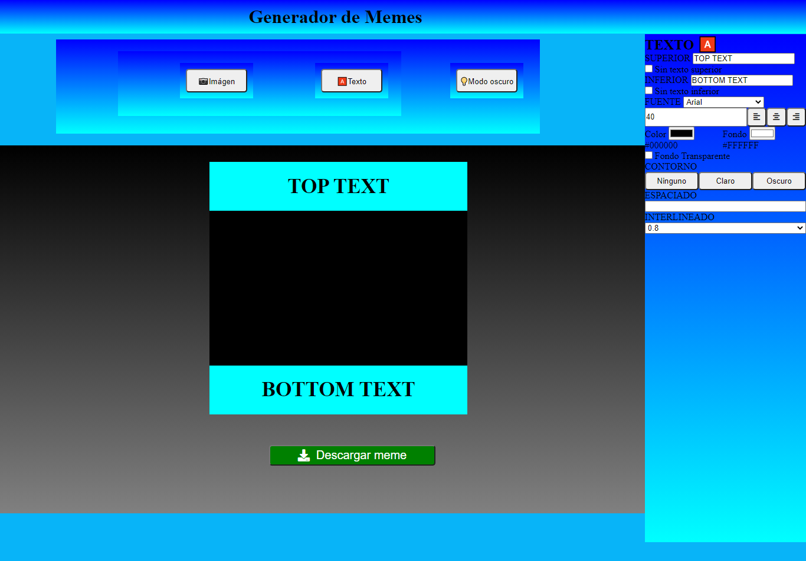

#Editor de Memes

## Este proyecto está realizado para emplear funcionalidades nuevas con JavaScript 

***

## Para ver cómo quedó el proyecto, puedes dar click al siguiente [enlace](https://karijofre.github.io/Editor-de-memes/) o puedes hacerlo desde [acá](https://vigorous-mcnulty-98ca20.netlify.app/)
<br>

***
## Para obtener el código en tu ordenador, sigue los siguientes pasos en tu terminal.
***

- Ir al [repositorio](https://karijofre.github.io/Editor-de-memes/)
- Darle click al botón de Code.
- Copia la url.
- Abre tu terminal y pon el comando de ``` git clone <url>```
- Entra en la carpeta del proyecto y ábrelo en tu IDE

## Este proyecto no necesita la instalación de ninguna dependencia, por el momento 😊

***
<br>

## Este debería ser el resultado final del proyecto instalado



***

### De Kari Jo con ❤